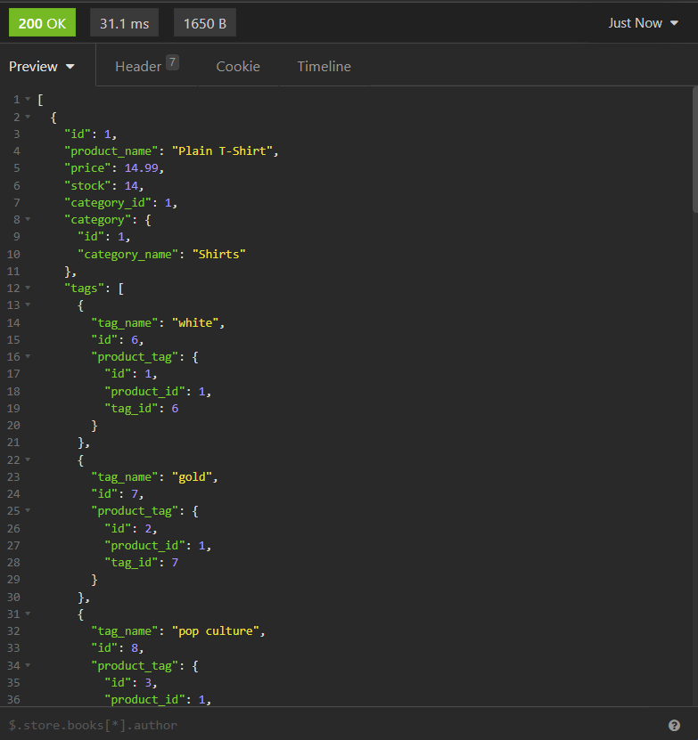

[comment]: <> (This readme was created by Nodinq Readme Generator)

# Ecommerce Express.js API w/ Sequelize

## Description

Model of building the back-end for an e-commerce site. Taking a working Express.js API and configuring it to use Sequelize in order to interact with a MySQL database.

## Screenshot

## Table of Contents

- [Installation](#installation)
- [Usage](#usage)
- [Datanase Models](#database-models)
- [Credits](#credits)
- [Questions](#questions)

## Installation

Clone this project and run `npm install`. On MySQL CLI create the database with the following command in the root of the project. `source ./db/schema.sql`.Then seed the tables using `npm run seed`. Finally start the server running this command `npm start`.

## Database Models

* `Category`

  - `id`
    - *Integer*
    - *Not null*
    - *Primary key*
    - *Auto increment*

  - `category_name`
    - *String*
    - *Not null*

* `Product`
  - `id`
    - *Integer*
    - *Not null*
    - *Primary key*
    - *Auto increment*

  - `product_name`
    - *String*
    - *Not null*

  - `price`
    - *Decimal*
    - *Not null* 

  - `stock`
    - *Integer*
    - *Not null* 
    - *default 10*

  - `category_id`
    - *Integer*

* `Tag`
  - `id`
    - *Integer*
    - *Not null*
    - *Primary key*
    - *Auto increment*

  - `tag_name`
    - *String*
    - *Not null*

* `ProductTag` (Through Table)
  - `id`
    - *Integer*
    - *Not null*
    - *Primary key*
    - *Auto increment*

  - `product_id`
    - *Integer*

  - `tag_id`
    - *Integer*

## Usage

Use Insomnia to test RESTful API implementation with HTTP methods POST, GET, GET by id, PUT and DELETE by id.

### End Points

* /api/categories
* /api/products
* /api/tags

### Watch this video.
https://youtu.be/Uht_zDZBbjY

## Questions

Please send your questions [here](mailto:williamlocke.cello@gmail.com?subject=[GitHub]%20ORM%20eCommerce%20Bkend) or visit [github/dopecello](https://github.com/dopecello).

## Credits
William Locke      
